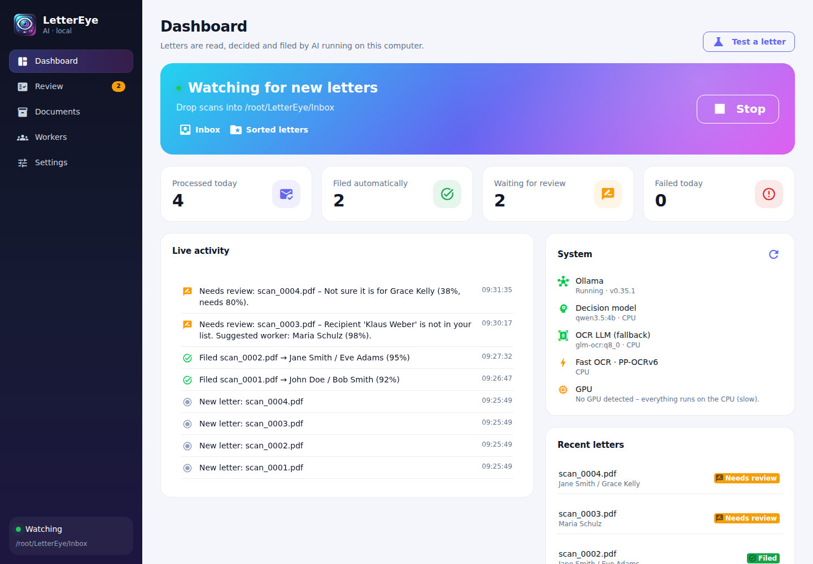
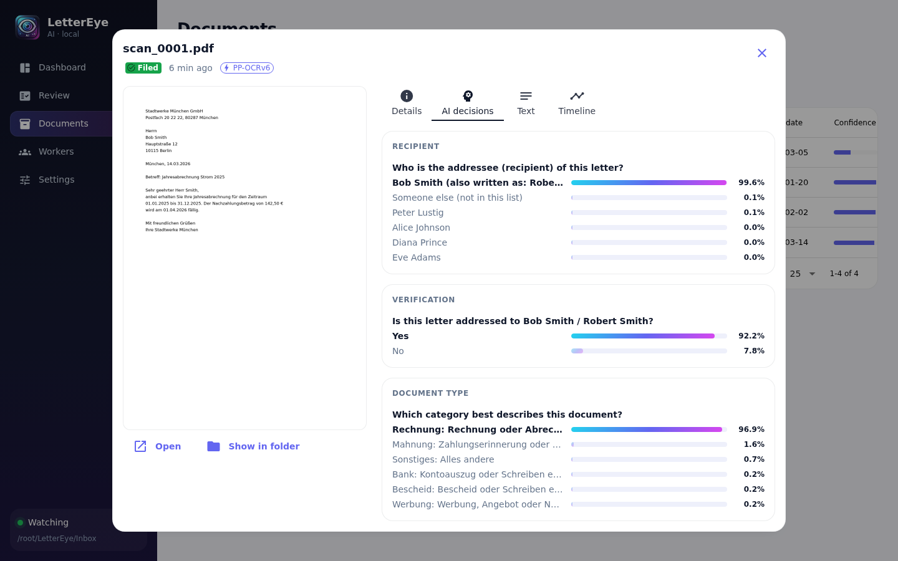
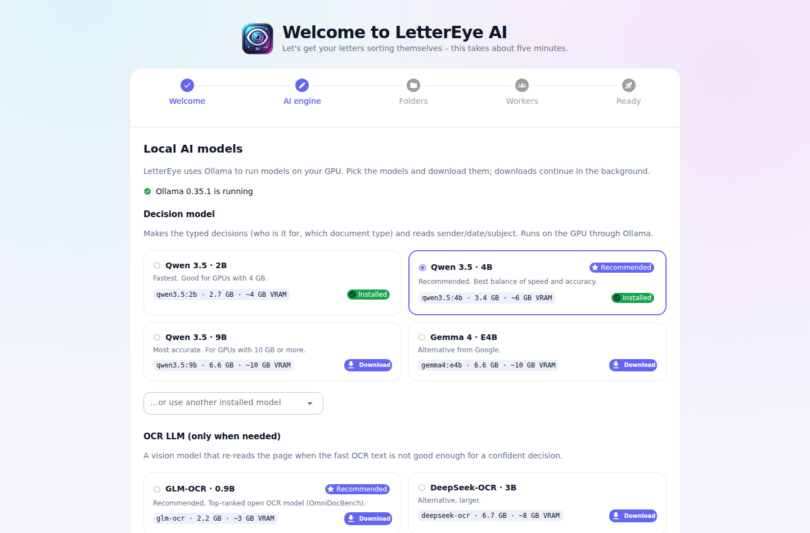
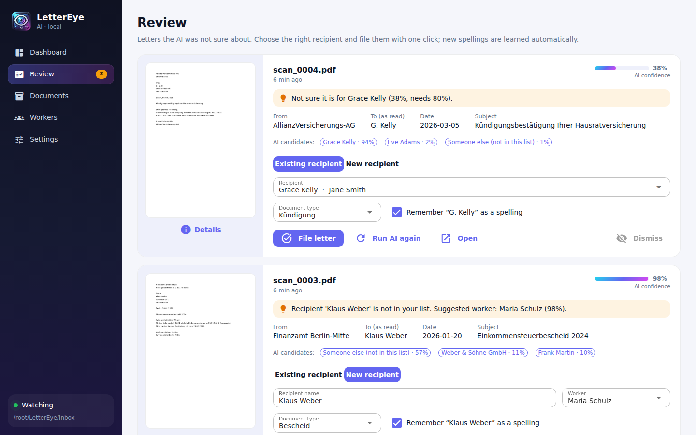
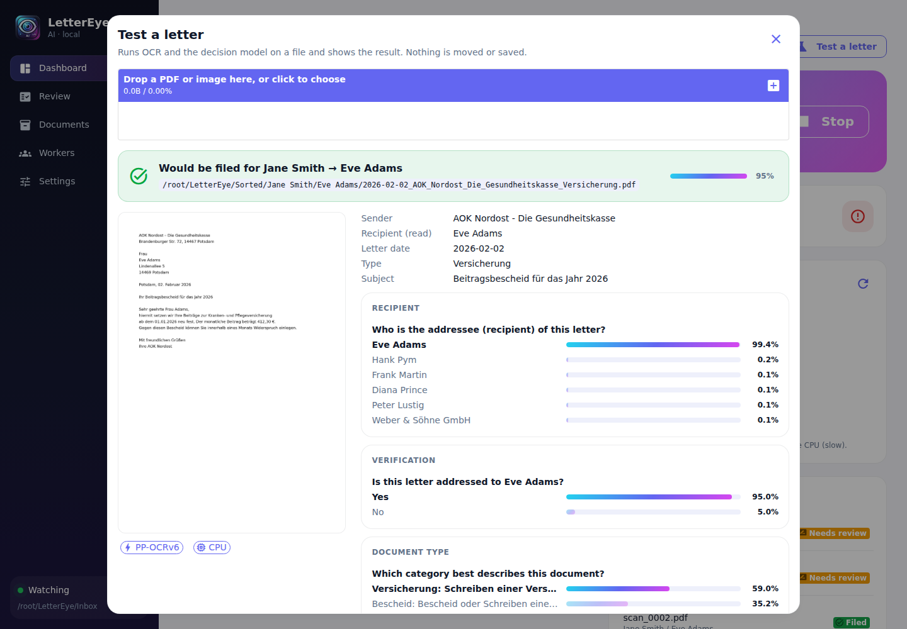
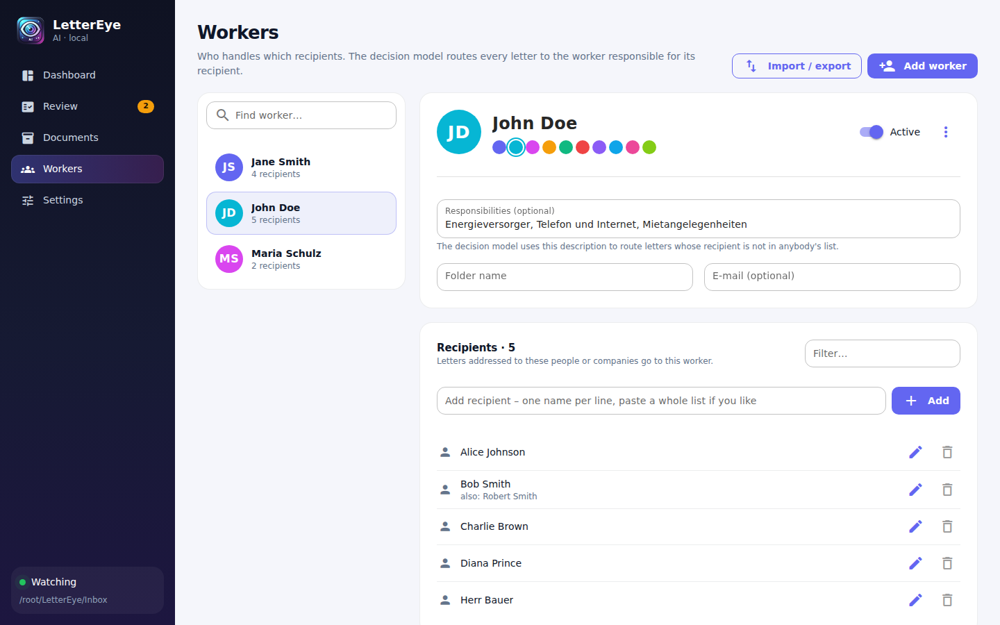
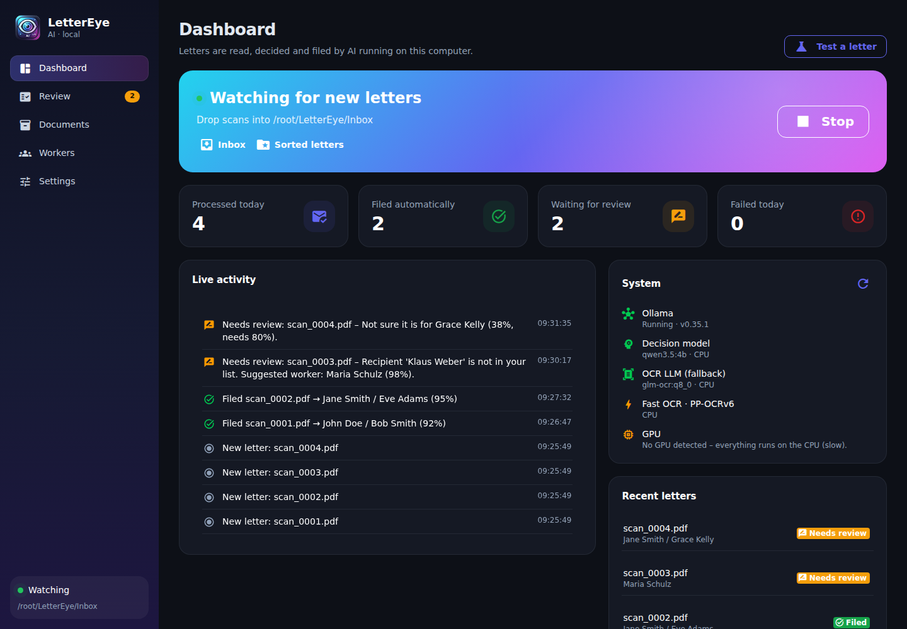

<p align="center">
  
</p>

<h1 align="center">LetterEye AI</h1>

<p align="center">
  <b>Scanned letters sort themselves – with AI that runs entirely on your own computer.</b><br>
  Windows · macOS · Linux · GPU-accelerated · no cloud, no API keys
</p>

---

LetterEye watches the folder your scanner saves to. Every new letter is read, a **local decision model**
works out who it is for, and the PDF is filed into `Worker / Recipient / 2026-03-14_Sender_Type.pdf`.
Letters it is not sure about land in a **review queue** where you file them with one click – and it
learns the spelling for next time.

Everything – workers, recipients, models, folders, naming – is managed in a desktop UI. No more
hand-written CSV files.



## How it works

```
 new scan ─► text layer / fast OCR ─► decision model ─► confident? ──yes──► filed: Worker/Recipient/…
             (PP-OCRv6 on your GPU)   (typed choices      │
                                       + probabilities)   no
                                                          ▼
                                       OCR LLM (GLM-OCR) re-reads the page ─► decide again
                                                          │
                                                   still unsure ─► Review queue (one click, learns)
```

1. **Read.** Digital PDFs use their embedded text. Scans go through **PP-OCRv6** (PaddleOCR, 2026) on
   ONNX Runtime – on the GPU via DirectML on Windows (NVIDIA, AMD and Intel), CUDA on Linux, or CoreML
   on macOS.
2. **Decide.** A local **System One-style decision model** – the idea behind TypeSafe's *Jev*, but
   running locally on Ollama. It never writes free text. Each question gets a list of options and the
   model returns one of them **with a probability**, read directly from the model's token
   probabilities in a single forward pass. It *cannot* invent a worker or recipient that is not in
   your list. Following Jev's guidance, LetterEye asks small atomic questions and combines them in code:
   - *Who is this letter addressed to?* → your recipients + "someone else" → worker via your data
   - *Is it really addressed to …?* → yes/no double check
   - *Recipient unknown? Which worker is responsible?* → by the workers' responsibility descriptions
   - *What kind of document is it?* → your document types (invoice, reminder, notice, …)

   Every question is asked twice with the options in reverse order to cancel position bias.
3. **Only if that is not confident enough**, the OCR LLM **GLM-OCR** (0.9 B, top of OmniDocBench) re-reads
   the page and the decisions are repeated. Most letters never need it.
4. **Name.** One small generative pass (LangChain structured output) reads sender, date and subject for
   the file name.
5. **File** – or **review** if the confidence is below your threshold (default 80 %).

All models run through **[Ollama](https://ollama.com)** with **LangChain** (`langchain-ollama`).

Every decision is visible in the app – here the letter above was routed to Bob Smith with 99.6 %, double-checked
with a yes/no question (92 %) and typed as an invoice (97 %):



## What you need

| | |
|---|---|
| **OS** | Windows 10/11 (primary), macOS 13+, Linux |
| **GPU** | Recommended. 6 GB VRAM runs the default models comfortably; 4 GB works with the small model. Without a GPU everything still works, just slowly. |
| **Ollama** | Free, from [ollama.com/download](https://ollama.com/download). Uses CUDA / ROCm / Metal automatically. |
| **Disk** | ~6 GB for the default models |

Python is installed automatically by the start script (via [uv](https://docs.astral.sh/uv/)).

## Quick start

### Windows

1. Install **Ollama** from [ollama.com/download](https://ollama.com/download) (it then runs in the tray).
2. Download this repository (green *Code* button → *Download ZIP*) and unzip it.
3. Double-click **`start-windows.bat`**.

The first start installs everything (a few minutes). Then the **setup assistant** opens and walks you through:
choosing and downloading the models (with a recommendation for your GPU), picking the inbox and output
folders, and adding your workers and their recipients. Done – start watching.



### macOS / Linux

```bash
git clone https://github.com/mikexkllr/LetterEye-AI.git
cd LetterEye-AI
./start.sh
```

On Linux the app opens in your browser. For a native window run `LETTEREYE_QT=1 ./start.sh`.

## Using LetterEye

| Page | What you do there |
|---|---|
| **Dashboard** | Start/stop watching, see what is happening live, check GPU and model status, **test any letter** without moving it |
| **Review** | Letters the AI was unsure about: see the page, the AI's candidates with probabilities, pick the recipient (or create a new one) and file it. The spelling is remembered as an alias. |
| **Documents** | Searchable history. Click a letter to see the page, every AI decision with its probability bars, the recognized text and a timing breakdown. |
| **Workers** | Add workers, give them recipients (paste a whole list at once), alternative spellings, a folder name, and an optional *responsibility* description the AI uses for letters to unknown recipients. Import/export CSV. |
| **Settings** | Folders, models, OCR strategy and GPU, confidence threshold, file-name templates with live preview, document types, language, appearance. |



**Test a letter** runs the complete pipeline on any PDF and shows where it would go – nothing is moved:





Light and dark mode follow your system (or pick one in Settings → General).



## Models

| Role | Default | Alternatives | Size |
|---|---|---|---|
| Decision model | `qwen3.5:4b` | `qwen3.5:2b` (4 GB GPUs), `qwen3.5:9b` (≥10 GB), `gemma4:e4b`, any Ollama model | 3.4 GB |
| OCR LLM (fallback) | `glm-ocr` | `deepseek-ocr`, vision models such as `qwen3.5` | 2.2 GB |
| Fast OCR | PP-OCRv6 small (multilingual) | tiny / medium | ~30 MB |

Models are downloaded from inside the app. The dashboard shows whether each model sits fully in GPU
memory.

OCR strategies (Settings → OCR & GPU):

* **Smart** (default): fast OCR first, the OCR LLM only when the decision model is unsure.
* **Fast only**: never the OCR LLM (least GPU memory).
* **Best quality**: always read scans with the OCR LLM.

## Where things are stored

| | |
|---|---|
| Settings, database, OCR models, logs | `%LOCALAPPDATA%\LetterEye` (Windows), `~/Library/Application Support/LetterEye` (macOS), `~/.local/share/LetterEye` (Linux) |
| Uncertain letters | `<output>\_Review` |
| Letters that could not be processed | `<output>\_Failed` |

Use `--data-dir PATH` for a portable setup.

## Command line

```
lettereye                      start (native window, browser fallback)
lettereye --browser            open in the browser instead
lettereye --port 8765          change the port (default 8765, local only)
lettereye --data-dir PATH      keep all data in PATH
lettereye --no-autostart       do not start watching automatically
lettereye analyze letter.pdf   run the whole pipeline on one file and print the result as JSON
```

## Coming from LetterEye 1.x

Your old `csv_files` folder (`Firstname_Lastname.csv` with one recipient per line) can be imported in the
setup assistant or on **Workers → Import / export → Import old LetterEye CSV folder**. The `.env`
file is no longer used; all settings live in the app. The old samples are in `examples/legacy_csv`.

## Build a standalone app

```bash
uv run --extra build python scripts/build.py
```

Creates `dist/LetterEye/` (with `LetterEye.exe` on Windows). Zip the folder to share it; users still
install Ollama once.

## Development

```bash
uv run --extra dev pytest          # 61 tests, no GPU or Ollama needed (the AI is faked)
uv run --extra dev ruff check .
```

Project layout:

```
lettereye/
  ai/          decision engine (Jev-style typed decisions), fact extraction, Ollama service
  ocr/         PDF/image loading, PP-OCRv6 (GPU), OCR LLM
  pipeline/    the processing pipeline, file naming, date parsing
  services/    inbox watcher, processing engine
  ui/          NiceGUI desktop UI (pages, widgets, theme)
  db.py        SQLite: workers, recipients, documents
  settings.py  settings model + storage
tests/
```

## Troubleshooting

* **"Ollama is not reachable"** – start Ollama (Windows: from the Start menu, it then sits in the tray).
* **Model shows "partly on CPU"** – the model does not fit into your GPU memory; pick a smaller one in Settings → AI models.
* **Fast OCR runs on CPU on Windows** – update the graphics driver (DirectML needs Windows 10 1903+ with a DX12 GPU).
* **Linux: CUDA not used for fast OCR** – install the CUDA 12 runtime and cuDNN 9, or ignore it: OCR on the CPU is still fast.
* Logs: Settings → General → *Open logs*.

## License

MIT
